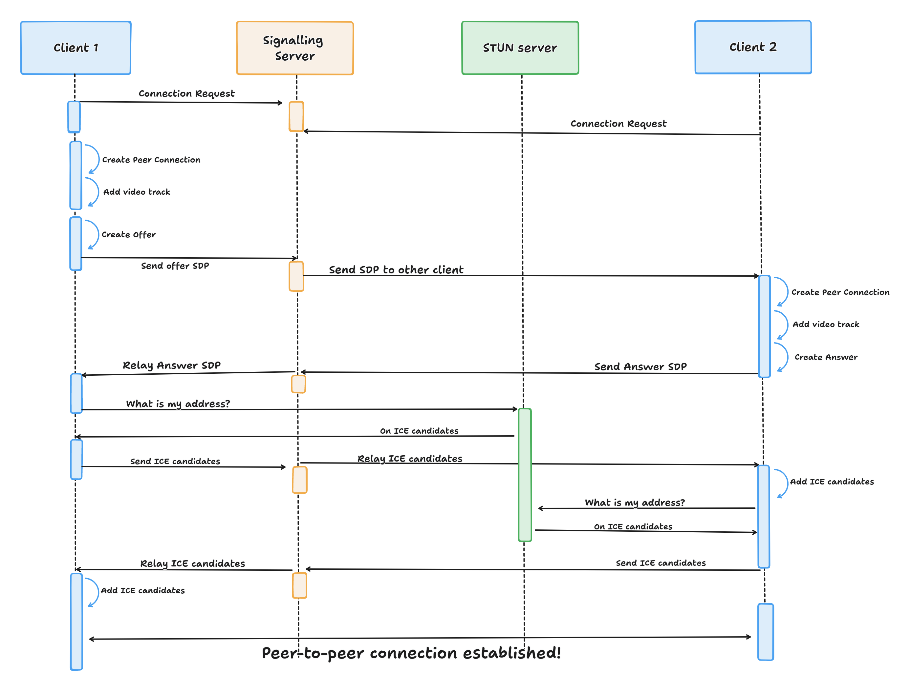
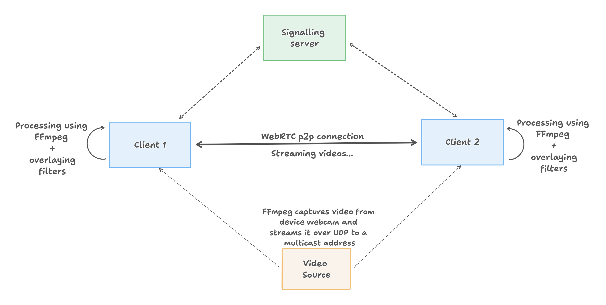
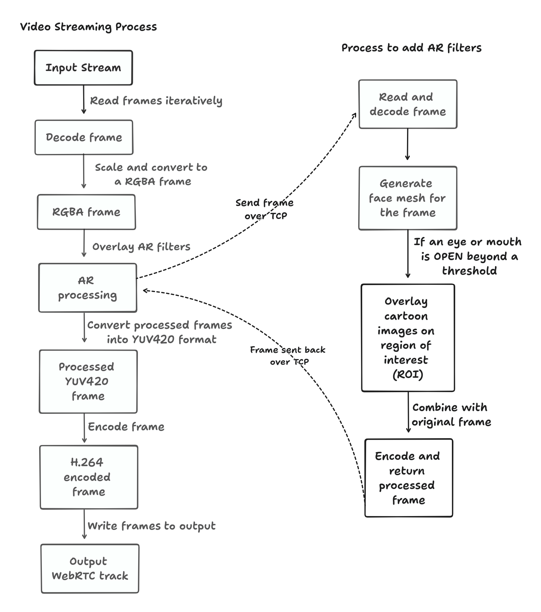

# Augmented Reality Video Streaming over WebRTC

The next generation of real-time streaming applications like video-conferencing apps will augment video streams that are generated and computed from the feed. Understanding computation overheads present in enabling such advanced features can inform scheduling strategies within the edge computing environments. This research project aims to explore the possibilities of distributing the components of WebRTC, the backbone technology for real-time video conferencing, across edge devices. We specifically focus on the analysis of the computational overheads associated with deploying augmented reality and FFmpeg filters in video streams.

## The basics


*The above figure demonstrates the workflow to setup a peer-to-peer WebRTC connection*


*Video streaming setup*


*The above flowchart describes the steps involved in overlaying Augmented-Reality filters by processing a video stream frame-by-frame*

## Experimental Setup
### Step1: Compile source code
In the current directory, execute the below commands 
```
make clean
make
```

### Step2: Start the signalling server
```
./bin/main --server
```

### Step3: Bring 2 clients into the system
Start a client in two different terminals
```
./bin/main --client
```

### Step4: Start the AR-processing script
```
python3 ar-filters/app.py
```

### Step5: Start the video streaming source
```
ffmpeg -f v4l2 -i /dev/video0 -f mpegts udp://224.0.0.251:5353
```

*For more details about the methodology and results, please refer to the [project report](project_report.pdf).*
